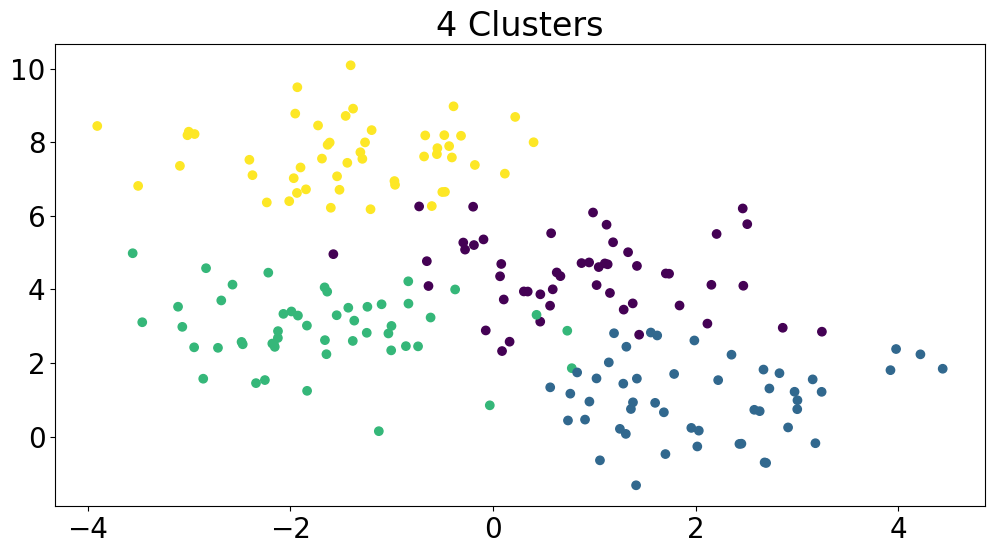
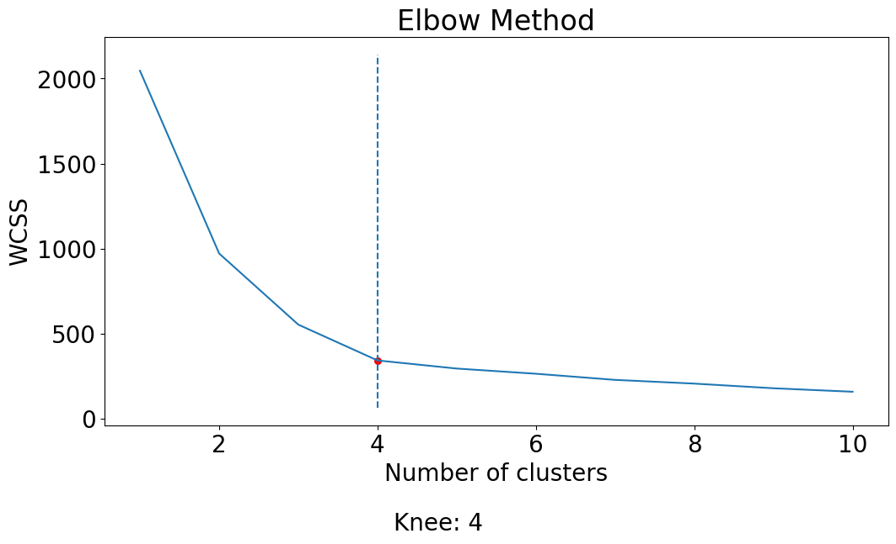

The elbow method is an important tool in the field of machine learning, particularly for data clustering. It provides a way to determine the optimal number of clusters for a clustering algorithm, which is crucial for effectively modeling and understanding complex data. The basic idea behind the elbow method is that increasing the number of clusters will result in a decrease in the within-cluster sum of squared distances (WCSS). Still, at some point, the decrease will no longer be significant enough to justify the increase in the number of clusters.

In mathematical optimization, the concept of the “elbow” or “knee of a curve” is a commonly used heuristic to choose a point where diminishing returns are no longer worth the additional cost. In clustering, this means that one should choose a number of clusters so that adding another cluster does not significantly improve the modeling of the data. The elbow method works by plotting the WCSS against the number of clusters and finding the point where the decrease in WCSS slows down, creating an elbow-like shape in the plot. This elbow-like shape indicates the optimal number of clusters, with the region before the elbow being under-fitting and the region after being over-fitting.

<br></br>

## How The Elbow Method Work
The elbow method is based on the principle that adding more clusters to the fit will improve the explanation of the variation in the data, but at a certain point, this improvement will start to slow down and the additional clusters will become redundant. For instance, if the actual data consists of k distinct groups, clustering with a number greater than k will lead to over-fitting, as the data will be divided into smaller, tighter clusters. Initially, the first few clusters will add significant information to the explanation of the variation, as the data contains that many distinct groups, but once the number of clusters surpasses the actual number of groups, the information added will decrease rapidly. This information drop is reflected in the graph of the explained variation versus the number of clusters, where there is a sudden change from a rapid increase to a slower increase, creating a sharp elbow-like shape in the graph. The elbow-like shape indicates the optimal number of clusters, with the region before the elbow being under-fitting and the region after being over-fitting.

<br></br>

## Simplifying the Elbow Method with the kneed Library
The `kneed` library provides a simple and convenient way to determine the optimal number of clusters for a k-means clustering algorithm, without requiring manual inspection of the plot of WCSS against the number of clusters. The library provides a `KneeLocator` function that can be used to find the knee or elbow point in a given set of data, which can then be used to determine the optimal number of clusters.

Installation is straightforward and can be done from PyPi.   
`pip install kneed`

First, we create a toy dataset with 4 clusters using make_blobs function from scikit-learn.

```python
import numpy as np
import matplotlib.pyplot as plt
from kneed import KneeLocator
from sklearn.cluster import KMeans
from sklearn.datasets import make_blobs

# generate toy dataset with 4 clusters
X, y = make_blobs(n_samples=200, centers=4, random_state=0)
plt.scatter(X[:,0], X[:,1], c=y)
plt.title('4 Clusters')
plt.show()
```



Then, the optimal number of clusters can be determined by following these steps:

1. Calculating the WCSS (within-cluster sum of squared distances) for different values of k (number of clusters) using a for-loop. Here, `KMeans` class is used to fit the K-means algorithm to the data `X`. The `inertia_` attribute of the fitted KMeans object is used to calculate the WCSS and the result is appended to the wcss list.

2. Plotting the WCSS versus the number of clusters.

3. Finding the knee location using the `KneeLocator` class. The `KneeLocator` function takes three arguments: the range of values for the number of clusters, the WCSS values, and some other optional parameters such as the type of curve and the direction of the curve.

4. Plotting the knee location on the WCSS versus the number of clusters plot. The `vlines` function is used to plot a vertical line at the knee location and the `scatter` function is used to plot a red dot at the knee location.

```python
# compute WCSS for different values of k
wcss = []
for i in range(1, 11):
    kmeans = KMeans(n_clusters=i, init='k-means++', max_iter=300, n_init=10, random_state=0)
    kmeans.fit(X)
    wcss.append(kmeans.inertia_)

# plot WCSS vs no. of clusters
plt.plot(range(1, 11), wcss)
plt.title('Elbow Method')
plt.xlabel('Number of clusters')
plt.ylabel('WCSS')

# find the knee location
knee = KneeLocator(range(1, 11), wcss, curve='convex', direction='decreasing')

# plot the knee location
plt.vlines(knee.knee, plt.ylim()[0], plt.ylim()[1], linestyles='dashed')
plt.scatter(knee.knee, knee.knee_y, color='red', s=30)
plt.text(knee.knee+0.2, knee.knee_y-1000, f'Knee: {knee.knee}')

# show the plot
plt.show()
```



<br></br>

## Drawbacks and Limitations
1. **Ambiguity**: In some cases, there may not be a clear “elbow” in the plot, making it difficult to determine the optimal number of clusters. This can result in the method failing to identify the appropriate number of clusters.

2. **Multimodal data**: If the data contains multiple distinct clusters with different sizes and densities, the elbow method may produce inaccurate results. In these cases, other methods such as Silhouette analysis or Gap statistics may be more appropriate.

3. **Assumes linearity**: The elbow method assumes that the WCSS decreases linearly with an increasing number of clusters. However, this may not always be the case in real-world data.

4. **Limited to K-means**: The elbow method is only applicable to the K-means clustering algorithm, and may not be suitable for other clustering algorithms such as Hierarchical Clustering or DBSCAN.

Despite these limitations, the elbow method is still widely used due to its simplicity and ease of implementation. However, it is important to consider other methods and interpret the results carefully to ensure that the correct number of clusters is chosen.