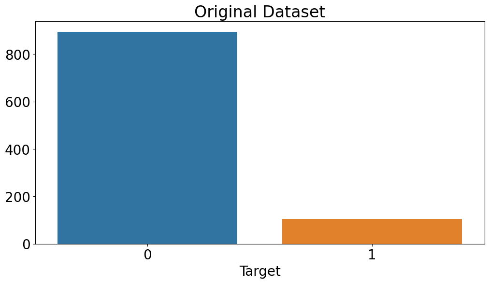
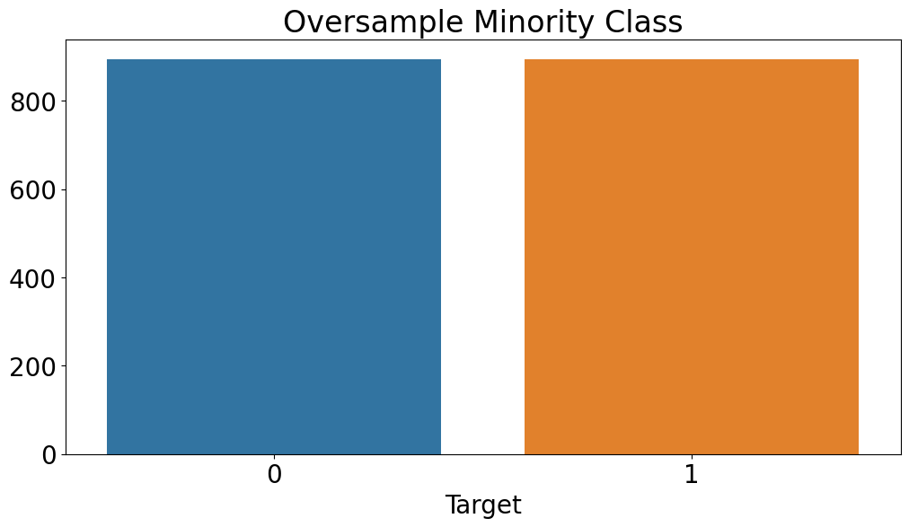
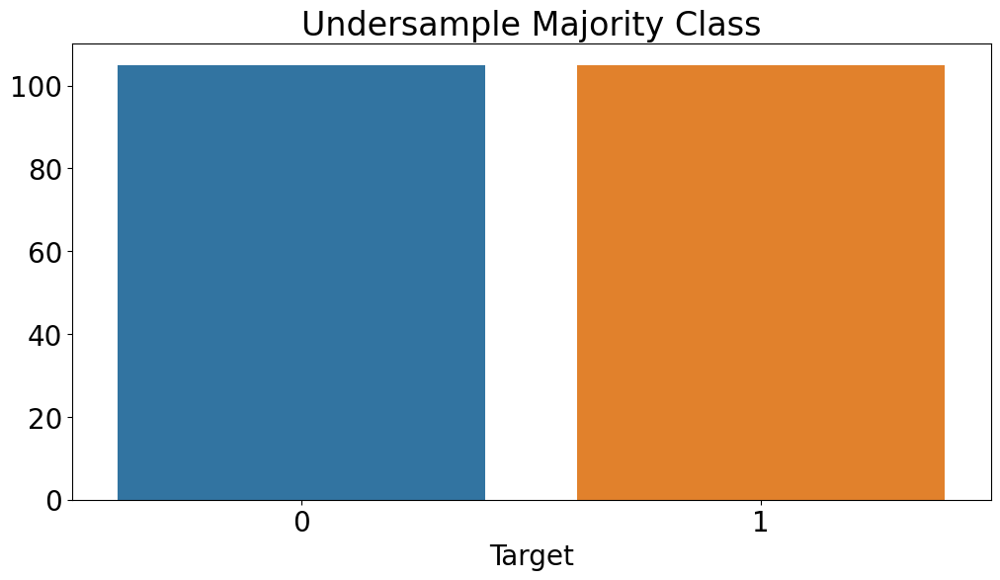
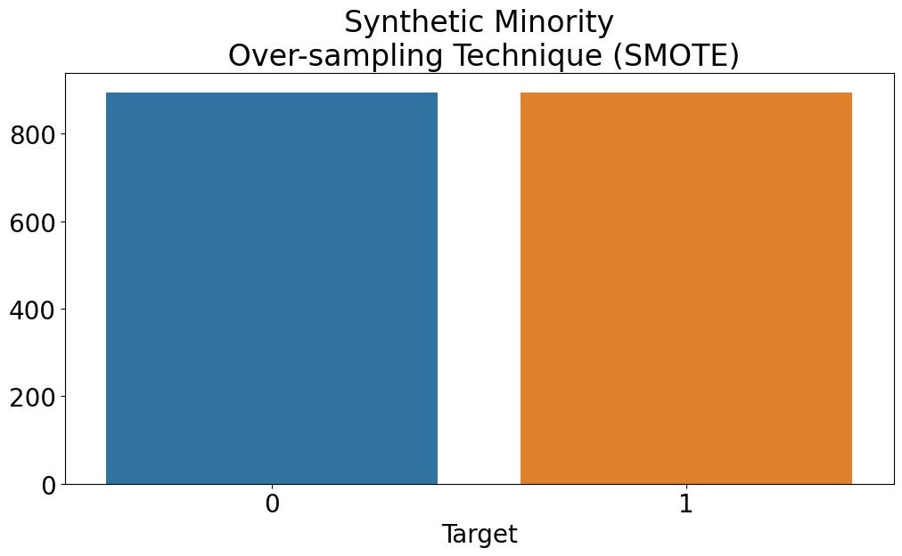
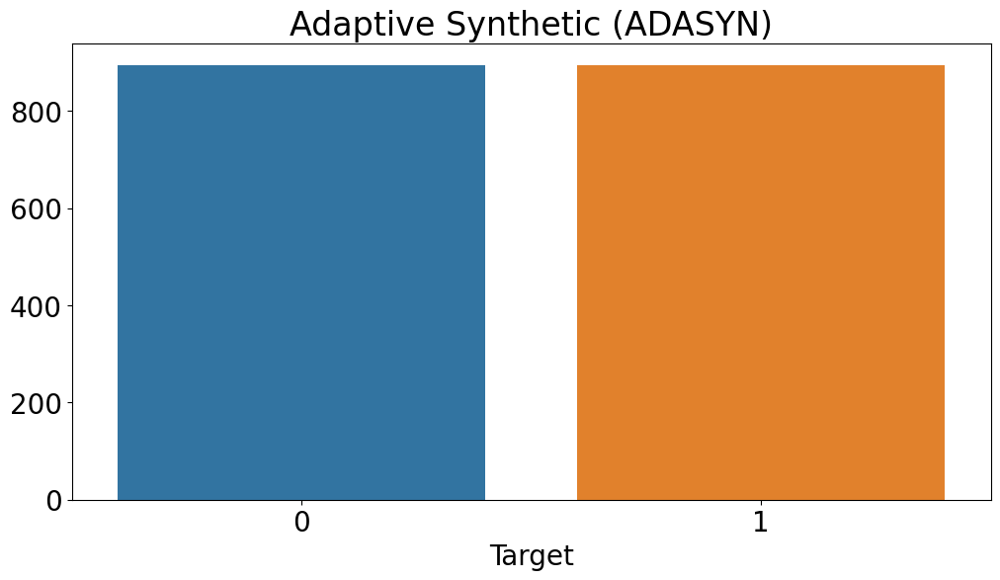

Class imbalance in binary classification refers to a situation where one class (minority class) has significantly fewer instances compared to the other class (majority class). For instance, in a customer attrition prediction task, the minority class could be customers who churned or left, while the majority class is customers who stayed with the company.

Class imbalance can pose a significant challenge in machine learning, particularly for binary classification tasks because most machine learning algorithms assume that the class distribution is balanced. When the class distribution is imbalanced, the model may be biased towards the majority class. The model will quickly learn that predicting the most frequent class will lead to great results, leading to poor performance in predicting the minority class.

In the case of customer attrition, class imbalance occurs when the number of churned customers is significantly lower than the number of customers who have stayed. For example, if there are 1000 customers, and only 10 have churned, then the class distribution is imbalanced, and the minority class (churned customers) accounts for only 1% of the total dataset.

In this article, we will explore the causes and consequences of class imbalance in binary classification tasks and examine various strategies for dealing with class imbalance, such as oversampling, undersampling, and synthetic data generation, and highlight the drawbacks of each approach.

<br></br>

## Causes of Class Imbalance
### 1. Natural occurrence
In some domains, the minority class may naturally occur less frequently. For example, in fraud detection, only a small percentage of transactions are fraudulent.

### 2. Data collection
Class imbalance can also be caused by the way data is collected. For instance, in a medical study, the number of healthy individuals may significantly outnumber those with a particular disease.

### 3. Sampling bias
When the data collection process is biased towards a particular group, it can result in class imbalance. For example, if a survey on job satisfaction is conducted only among current employees, the number of employees who left the organization may be significantly lower, leading to class imbalance.

### 4. Human biases
Human biases, such as racial or gender biases, can also contribute to class imbalance in data.

<br></br>

## Consequences of Class Imbalance
### 1. Biased models
Most machine learning algorithms are designed to optimize accuracy, leading to biased models that perform poorly on the minority class. Models trained on imbalanced data may result in a high number of false negatives, i.e., cases where the minority class is misclassified as the majority class.

### 2. Overfitting
Overfitting occurs when the model learns the characteristic of the training data rather than the underlying patterns. In imbalanced datasets, overfitting is more likely to occur as the model tends to learn more about the majority class, leading to poor generalization performance.

### 3. Misleading evaluation metrics
In imbalanced datasets, accuracy can be a misleading evaluation metric. For example, if the majority class accounts for 95% of the dataset, a model that predicts only the majority class will have an accuracy of 95%. However, such a model is useless for practical purposes, as it fails to detect the minority class of interest.

### 4. Increased cost of misclassification
In some applications, the cost of misclassifying the minority class can be significantly higher than the majority class. For instance, in medical diagnosis, missing a positive diagnosis can have severe consequences for the patient’s health. In such cases, models trained on imbalanced data can lead to significant costs and risks.

### 5. Unfairness and biases
In some cases, class imbalance can be a result of human biases, leading to unfair or biased models. For instance, if a dataset on job applications contains a disproportionately low number of applications from a particular demographic, models trained on this data may be biased towards the majority group, leading to unfair hiring practices.

<br></br>

## Dealing with Class Imbalance
Several techniques can be employed to address the class imbalance, such as oversampling the minority class, undersampling the majority class, and using synthetic data generation techniques to create new samples for the minority class. To implement these techniques in Python, the `imbalanced-learn` library can be used. `imbalanced-learn` is a powerful Python library that provides a range of tools to handle class imbalance in machine learning tasks. It offers a variety of resampling techniques such as oversampling, undersampling, and hybrid methods, which can be used to balance the class distribution. In addition, the library provides a set of evaluation metrics for measuring the performance of machine learning models on imbalanced datasets, along with methods for ensemble learning and cost-sensitive learning.

In this example, we generated a dataset with 1000 samples, 2 features, and 2 classes, with a class imbalance of 90:10 (the majority class has a weight of 0.9, and the minority class has a weight of 0.1). We then converted the numpy array to a pandas DataFrame and plot the class distribution to verify that the dataset is imbalanced.

```python
import pandas as pd
import matplotlib.pyplot as plt
import seaborn as sns
from sklearn.datasets import make_classification

# generate a toy dataset with 1000 samples, 2 features, and 2 classes
X, y = make_classification(n_samples=1000, n_features=2, n_informative=2,
                            n_redundant=0, n_clusters_per_class=1, weights=[0.9, 0.1],
                            random_state=42)

# convert the numpy array to a pandas DataFrame
df = pd.DataFrame(X, columns=['Feature 1', 'Feature 2'])
df['Target'] = y

sns.countplot(x='Target', data=df)
plt.show()
```



### 1. Oversampling
Oversampling involves creating more instances of the minority class by randomly duplicating them or creating new synthetic instances. This technique aims to balance the class distribution, making the model less biased towards the majority class. However, oversampling can lead to overfitting, where the model performs well on the training data but poorly on the test data. It can also increase the computational cost, particularly if the dataset is already large.

```python
from imblearn.over_sampling import RandomOverSampler

# apply oversampling to the dataset
oversampler = RandomOverSampler(random_state=42)
X_resampled, y_resampled = oversampler.fit_resample(X, y)

# create a new Pandas DataFrame to store the resampled dataset
df_resampled = pd.DataFrame(X_resampled, columns=['Feature 1', 'Feature 2'])
df_resampled['Target'] = y_resampled

# plot the distribution of the resampled dataset
sns.countplot(x='Target', data=df_resampled)
plt.title('Oversample Minority Class')
plt.show()
```



### 2. Undersampling
Undersampling involves randomly removing instances from the majority class to balance the class distribution. This technique aims to reduce the bias towards the majority class and improve the performance of the model on the minority class. However, undersampling can lead to loss of information and may result in underfitting, where the model is unable to capture the complexity of the problem.

```python
from imblearn.under_sampling import RandomUnderSampler

# apply undersampling to the dataset
undersampler = RandomUnderSampler(random_state=42)
X_resampled, y_resampled = undersampler.fit_resample(X, y)

# create a new Pandas DataFrame to store the resampled dataset
df_resampled = pd.DataFrame(X_resampled, columns=['Feature 1', 'Feature 2'])
df_resampled['Target'] = y_resampled

# plot the distribution of the resampled dataset
sns.countplot(x='Target', data=df_resampled)
plt.title('Undersample Majority Class')
plt.show()
```



### 3. Synthetic data generation
Synthetic data generation involves creating new instances of the minority class using algorithms such as SMOTE (Synthetic Minority Over-sampling Technique) or ADASYN (Adaptive Synthetic Sampling). These algorithms generate synthetic instances by interpolating between existing minority class instances. While synthetic data generation can improve model performance on the minority class, it can also introduce noise and overfitting.

```python
from imblearn.over_sampling import SMOTE, ADASYN

# apply SMOTE to the dataset
smote = SMOTE(random_state=42)
X_resampled_smote, y_resampled_smote = smote.fit_resample(X, y)

# create a new Pandas DataFrame to store the SMOTE resampled dataset
df_resampled_smote = pd.DataFrame(X_resampled_smote, columns=['Feature 1', 'Feature 2'])
df_resampled_smote['Target'] = y_resampled_smote

# plot the distribution of the SMOTE resampled dataset
sns.countplot(x='Target', data=df_resampled_smote)
plt.title('Synthetic Minority Over-sampling Technique (SMOTE)')
plt.show()

# apply ADASYN to the dataset
adasyn = ADASYN(random_state=42)
X_resampled_adasyn, y_resampled_adasyn = adasyn.fit_resample(X, y)

# create a new Pandas DataFrame to store the ADASYN resampled dataset
df_resampled_adasyn = pd.DataFrame(X_resampled_adasyn, columns=['Feature 1', 'Feature 2'])
df_resampled_adasyn['Target'] = y_resampled_adasyn

# plot the distribution of the ADASYN resampled dataset
sns.countplot(x='Target', data=df_resampled_adasyn)
plt.title('Adaptive Synthetic (ADASYN)')
plt.show()
```




<br></br>

## Conclusion
In conclusion, class imbalance is a common problem in binary classification tasks, and it can lead to poor performance of machine learning models. Fortunately, several strategies can be used to deal with this problem, such as oversampling, undersampling, and synthetic data generation. Each approach has its advantages and drawbacks, and the choice of the best strategy will depend on the specific task and the characteristics of the dataset. The `imbalanced-learn` package provides a comprehensive set of tools for implementing these strategies in Python, along with evaluation metrics for assessing the performance of models on imbalanced datasets. By carefully selecting the most appropriate technique and using these tools, we can improve the accuracy and reliability of our models in real-world applications with imbalanced data.