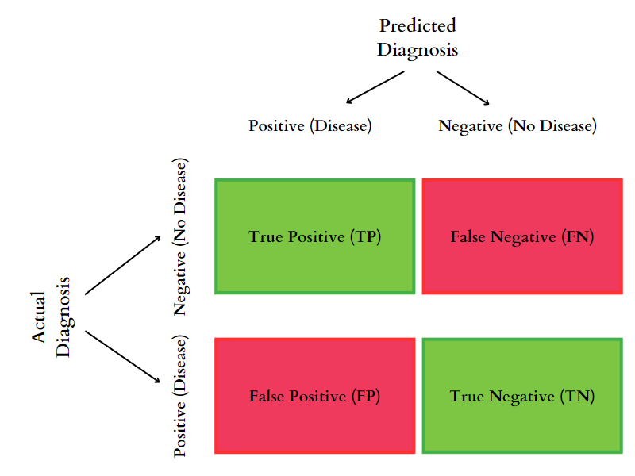

When working with machine learning models, it is essential to evaluate their performance to determine if they are making accurate predictions. One of the most popular methods of evaluating the performance of a model is by using a confusion matrix. A confusion matrix is a table that is used to evaluate the accuracy of a classification model.

## What is a Confusion Matrix?
A confusion matrix is an essential tool used to evaluate the performance of a classification model. In classification problems, simply measuring accuracy may not be enough, especially if the classes are imbalanced. Therefore, a confusion matrix can give us a more detailed and informative summary of a model’s performance.

The confusion matrix is constructed by using four different values: true positives (TP), false positives (FP), true negatives (TN), and false negatives (FN). These values represent the number of times that the model correctly or incorrectly predicted the positive or negative class.

True positives (TP) are the number of correct predictions that the model made for the positive class. False positives (FP) are the number of incorrect predictions that the model made for the positive class. True negatives (TN) are the number of correct predictions that the model made for the negative class, and false negatives (FN) are the number of incorrect predictions that the model made for the negative class.

Imagine a doctor trying to diagnose a patient for a disease. The patient either has the disease (positive) or doesn’t have it (negative), and the doctor’s diagnosis can either be right or wrong.

* True Positive (TP): The doctor correctly diagnoses the patient with the disease when the patient actually has it.
* False Positive (FP): The doctor diagnoses the patient with the disease when the patient does not have it.
* True Negative (TN): The doctor correctly determines that the patient does not have the disease when the patient actually does not have it.
* False Negative (FN): The doctor fails to diagnose the patient with the disease when the patient actually has it.

  

## How to Interpret a Confusion Matrix?
A confusion matrix provides valuable insights into the performance of a classification model. By analyzing the values in the matrix, we can determine the accuracy, precision, recall, and F1 score of the model.

### Accuracy
Accuracy is the most commonly used metric to evaluate the performance of a classification model. It is calculated by dividing the sum of true positives and true negatives by the total number of predictions made by the model. A high accuracy score indicates that the model is making correct predictions most of the time.

### Precision
Precision is the ratio of true positives to the sum of true positives and false positives. It measures the proportion of positive predictions that were actually correct. A high precision score indicates that the model is making very few false positive predictions.

### Recall
Recall is the ratio of true positives to the sum of true positives and false negatives. It measures the proportion of actual positives that were correctly identified by the model. A high recall score indicates that the model is correctly identifying positive instances.

### F1 Score
F1 score is the harmonic mean of precision and recall. It provides a balance between precision and recall, which makes it a better metric to evaluate the performance of a model when the dataset is imbalanced. A high F1 score indicates that the model is making both high precision and high recall predictions.

  

## Benefits of Using Confusion Matrix
### Improved accuracy evaluation
One of the primary advantages of a confusion matrix is that it provides a more detailed and nuanced evaluation of a model’s performance than just relying on overall accuracy. While overall accuracy can provide a general sense of how well a model is doing, a confusion matrix can reveal areas where the model may be struggling or performing exceptionally well.

### Identification of model strengths and weaknesses
By breaking down the results of a classification model into a confusion matrix, we can identify specific areas where the model is excelling or struggling. For example, a high true positive rate indicates that the model is correctly identifying positive instances, while a high false positive rate indicates that the model is incorrectly identifying negative instances as positive. By understanding the strengths and weaknesses of a model, we can make more informed decisions about how to improve its performance.

### Selection of appropriate evaluation metrics
The confusion matrix also allows us to calculate a variety of evaluation metrics, such as precision, recall, and F1-score. These metrics provide different perspectives on a model’s performance and can help us understand how well it is doing in different areas. For example, precision measures how many of the positive predictions were actually correct, while recall measures how many of the actual positive instances were correctly identified by the model.

### Optimization of model performance
Finally, the confusion matrix can help us make informed decisions about how to optimize a model’s performance. By analyzing the results of the confusion matrix, we can identify areas where the model may be struggling and take steps to address these issues. For example, if the model is producing a high number of false positives, we may need to adjust the classification threshold or improve the quality of the training data to reduce this error rate.

  

## Conclusion
A confusion matrix is an essential tool for evaluating the performance of a classification model. It provides a clear and concise way to determine the accuracy, precision, recall, and F1 score of a model. By analyzing the values in the matrix, we can determine the strengths and weaknesses of the model and make necessary adjustments to improve its performance. Machine learning practitioners should be familiar with the confusion matrix and utilize it as a primary tool to evaluate the performance of their classification models.